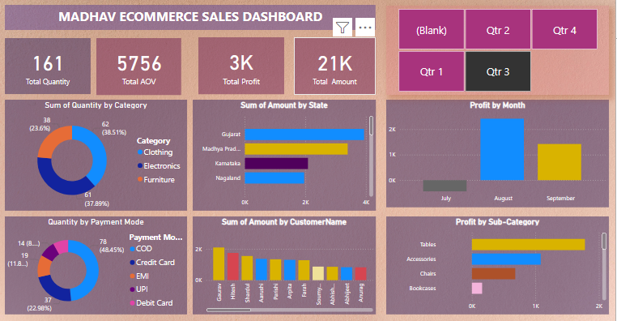

# Madhav Sales Dashboard 📊

An interactive dashboard created using Power BI to analyze and monitor Madhav's monthly and category-wise sales performance.

---

## 📌 Features

- 📅 Month-wise Sales Analysis
- 📍 Region & Category-wise Trends
- 📈 Top Performing Products
- 🧮 KPIs like Total Sales, Quantity Sold, Profit %
- 🔘 Interactive Filters (Category, Region, Month)

---

## 🧰 Tools & Technologies Used

- Power BI
- Microsoft Excel (for data cleaning)
- DAX (for calculated columns & measures)

---

## 🖼️ Dashboard Screenshots

### 🔹 Overview

### 🔹 Monthly Sales Trend

### 🔹 Top Products by Sales

---

## 📂 Project Structure
